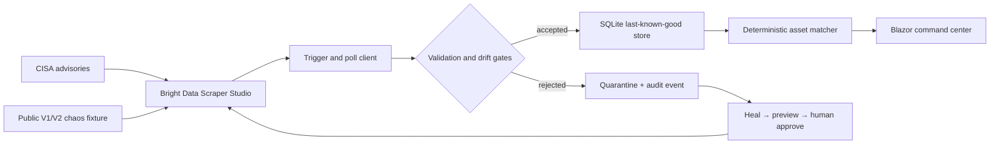

# LabWatch

**Self-healing regulatory intelligence for clinical laboratories.**

LabWatch turns public medical-device cybersecurity advisories into explainable, evidence-backed impact assessments against a fully synthetic laboratory inventory. When a source redesign breaks extraction, LabWatch quarantines the suspect run, preserves the last-known-good signal, and records the Bright Data healing and human approval as an auditable event.

> The website changed. The compliance signal didn't.

## Why it matters

Clinical laboratories depend on public safety and cybersecurity notices, but ordinary scraping failures can be silent. A missing manufacturer or collapsed record count should never look like “no new risk.” LabWatch treats extraction integrity as part of the regulated workflow.

## Architecture



The solution contains four production projects:

- `LabWatch.Core` — domain models, validation, canonical hashing, drift detection, and deterministic matching.
- `LabWatch.Infrastructure` — Bright Data API client, resilient polling, EF Core/SQLite persistence, ingestion, and demo seeding.
- `LabWatch.Web` — interactive Blazor dashboard, advisory evidence views, run controls, and audit timeline.
- `LabWatch.Fixture` — three fictional advisories with radically different V1/V2 layouts at one stable URL.

## Bright Data is the collection plane

All live advisory ingestion is designed for custom Bright Data Scraper Studio collectors. The app:

1. Calls `POST /dca/trigger` with a collector ID and URL input.
2. Stores the returned `collection_id` as `SnapshotId` (Bright Data uses both terms for the same run identifier).
3. Polls `GET /dca/dataset?id=...` until a JSON array is available.
4. Retries transient `5xx` responses with exponential backoff and enforces a total timeout.
5. Validates the entire snapshot before publishing any record.

See [Bright Data's API quickstart](https://docs.brightdata.com/datasets/scraper-studio/quickstart) and the exact project prompts in [docs/bright-data-prompts.md](docs/bright-data-prompts.md).

## Reliability guarantees

A snapshot is quarantined when it is empty, contains duplicate IDs/URLs, loses a required field, has over 20% invalid records, or drops more than 40% from the previous accepted run. Quarantined data never updates advisories or assessments.

Asset matching is deterministic and explainable:

- Manufacturer and product must match after explicit normalization and aliases.
- Model and parseable version ranges confirm or exclude impact.
- Missing or unparseable evidence becomes **Review required**, never **Affected**.
- Every disposition includes human-readable reasons and a source link.

## Run locally

Prerequisite: [.NET 10 SDK](https://dotnet.microsoft.com/download/dotnet/10.0).

```powershell
dotnet restore LabWatch.slnx
dotnet test LabWatch.slnx
./scripts/start-local.ps1
```

The script starts:

- Dashboard: `http://localhost:5180`
- Chaos fixture: `http://localhost:5181/advisories`

The database seeds a clearly labeled synthetic inventory, one public CISA-derived example, and fictional fixture advisories. The two rehearsal buttons demonstrate quarantine and healing without credentials or Bright Data usage.

## Connect live collectors

Use environment variables so secrets never enter source control:

```powershell
$env:BrightData__ApiToken = "your-token"
$env:BrightData__CisaCollectorId = "c_..."
$env:BrightData__FixtureCollectorId = "c_..."
$env:BrightData__FixtureUrl = "https://your-tunnel.trycloudflare.com/advisories"
$env:Fixture__BaseUrl = "https://your-tunnel.trycloudflare.com"
$env:Fixture__AdminToken = "a-random-demo-token"
$env:FIXTURE_ADMIN_TOKEN = $env:Fixture__AdminToken
```

Start a public Quick Tunnel after the fixture is running:

```powershell
cloudflared tunnel --url http://localhost:5181
```

Copy its HTTPS origin into the two fixture variables above, restart the dashboard, and build the fixture collector using [the supplied prompt](docs/bright-data-prompts.md). The fixture's admin endpoint requires `X-Fixture-Token`; only `/advisories` should be provided to the collector.

Switch layouts from the dashboard or PowerShell:

```powershell
./scripts/set-fixture-layout.ps1 -Layout v2 -Token "a-random-demo-token"
```

## Test coverage

The xUnit suite covers:

- successful trigger/poll and `collection_id` handling;
- building status, authentication failure, and transient server retry;
- parser schema variants;
- empty, missing-field, duplicate, and count-collapse quarantine;
- deterministic affected, not-affected, and review-required outcomes;
- repeated-run idempotency;
- preservation of accepted data after a quarantined snapshot.

```powershell
dotnet test LabWatch.slnx --configuration Release
```

## Self-healing demonstration

1. Start with fixture V1 and run the published fixture collector.
2. Switch the same `/advisories` URL to V2.
3. Rerun the collector. LabWatch rejects missing/collapsed data and displays the last trusted snapshot.
4. Run `brightdata scraper heal c_... "<repair prompt>"`.
5. Review the preview, then run `brightdata scraper approve c_...`.
6. Rerun the same collector ID and record the recovered run in LabWatch.

The 1:55 recording script is in [docs/demo-script.md](docs/demo-script.md).

## Data, privacy, and limitations

- Inventory and fixture advisories are synthetic and visibly labeled.
- No employer code, PHI, private inventory, or restricted vendor content is included.
- The application does not make clinical decisions. It supports cybersecurity/change-control review.
- The checked-in CISA example is a demo seed; use the live collector for current data.
- Healing approval remains deliberately human-gated.
- A Cloudflare Quick Tunnel URL is temporary and must be updated before the recorded live run.

## Judging evidence

| Criterion | Evidence |
|---|---|
| Impact | Prevents silent loss of safety signals in laboratory operations |
| Originality | Connects scraper healing to last-known-good regulated workflow controls |
| Technical quality | Typed API client, retry/timeout, validation, hashing, quarantine, idempotency, SQLite, tests |
| Bright Data use | Custom CISA and fixture collectors drive all live ingestion and healing |
| Reliability | Visible V1 → break → quarantine → approve → recovered V2 sequence |
| Presentation | Focused command center, evidence views, audit timeline, and sub-two-minute story |

## License

[MIT](LICENSE). CISA source links remain subject to CISA's own notices and policies.
